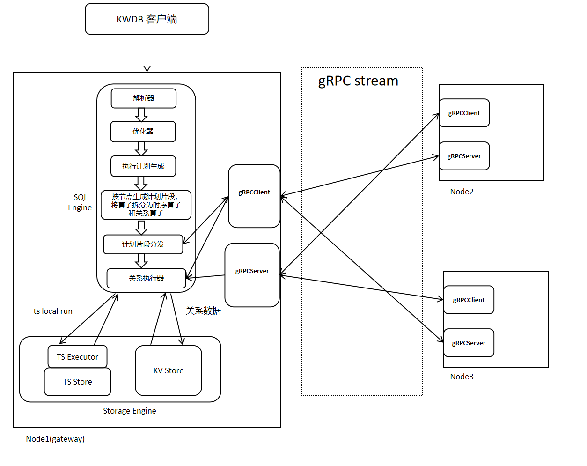
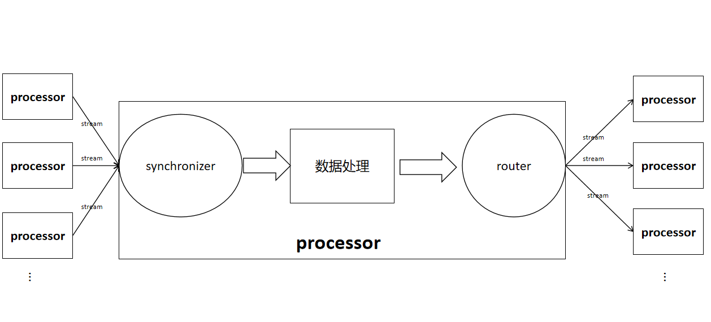
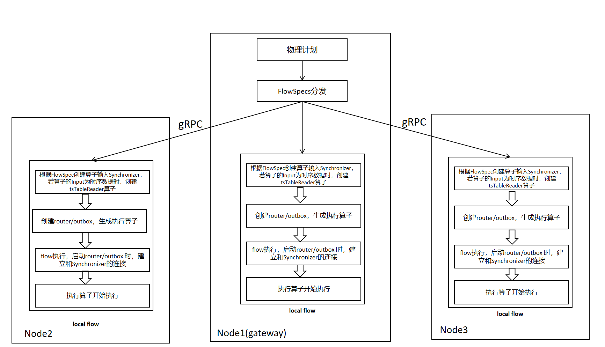
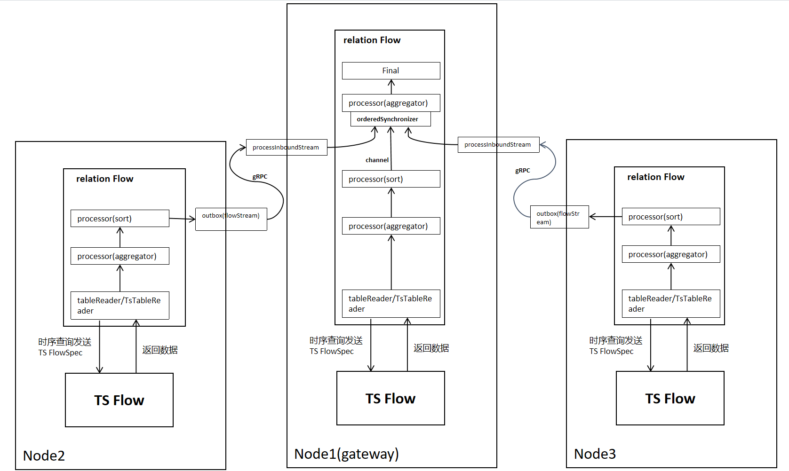
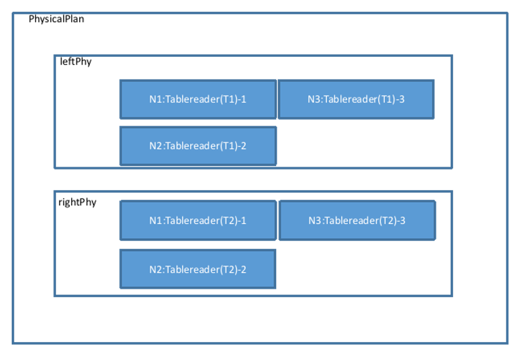
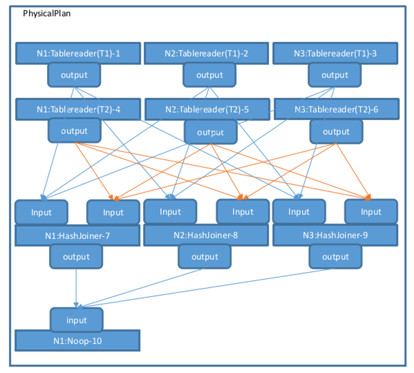
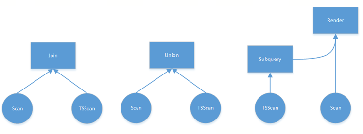
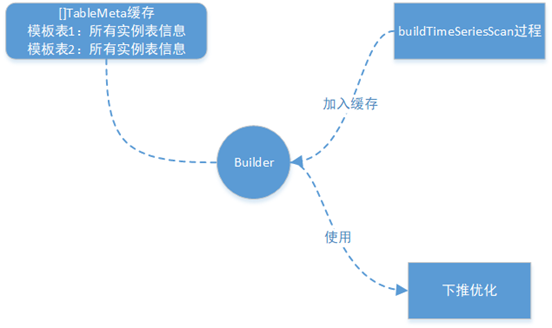
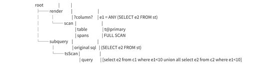

# KWDB SQL 执行

## 1. 概述

KWDB是一款 面向 AIoT 场景的分布式多模数据库 产品，支持在同一实例同时建立时序库和关系库并融合处理多模数据，具备千万级设备接入、百万级数据秒级写入、亿级数据秒级读取等时序数据高效处理能力，具有稳定安全、高可用、易运维等特点。

KWDB的SQL引擎由解析器、优化器和执行器组成，本期KWDB SQL执行内容主要介绍执行器。

KWDB分布式执行器将各个节点的计划片段分发到对应节点上，各个节点根据收到的计划片段，在各个节点上进行数据处理。分布式执行的优势一是利用分布式多节点的特性，各个节点实现并行计算、加速计算；二是分布式执行将计算发生在数据源所在的节点，实现“就地计算”，可以减少数据的网络传输。

## 2. KWDB 分布式执行基础架构

KWDB的分布式执行的基础架构如下图所示，分布式执行依赖于计划阶段生成分布式物理计划，通过gRPC进行数据和信息传输，在各个节点并行计算，最终在网关节点汇总。

执行流程如下：

当客户端输入一条SQL语句时，经过KWDB的解析器和优化器，生成一条代价尽可能低的表达式树，后续根据给定的表达式树生成可执行的执行计划，将计划中的算子拆分为关系算子和时序算子并按照节点生成不同节点上的计划片段，将各个节点计划片段分发到对应的节点，各个节点根据收到的计划片段开始执行。



### 2.1 基于Flow的执行计划

#### 2.1.1 基本概念解释

**stream:** 将一个算子输出路由器连接到另一个算子的输入同步器。

**input synchronizer:** 输入同步器，用于接收孩子节点计算的数据，根据是否要求有序分为两种InputSyncSpec_UNORDERED和InputSyncSpec_ORDERED。

**router/outbox:** 用于将本地数据发送至远端算子，当算子的输出stream只有一个的时候使用outbox，当算子的输出stream大于一个的时候使用router，router根据数据发送方式不同分为mirrorRouter、hashRouter、rangeRouter。

- **hashRouter:** 将数据行中的某些列进行hash处理，根据hash结果选择发送的节点stream。
- **mirrorRouter:** 将表的数据在各个节点复制一份，每一行都发送到所有输出stream。
- **rangeRouter:** 每一行都发送到一个stream，发送到哪个stream根据预设边界进行选择。

**stream、synchronizer、router在算子中的位置以及算子与算子间的联系大致如下图所示。**


**FlowSpec:** 用于存储Flow的信息，每个节点的执行器根据接收到的FlowSpec创建出该节点的Flow，FlowSpec内容包括FlowID(UUID)、gateway节点id、关系算子信息、时序算子信息。

**Flow:** 由物理计划节点集合、计划节点输入同步器、计划节点输出路由器、stream组成，各个节点根据FlowSpec构造出Flow，执行器根据Flow进行数据的计算和传输。

#### 2.1.2 单节点Flow的setup

单节点Flow的setup流程如下所示，根据计划阶段提供的算子信息生成本地FlowSpec，遍历FlowSpec中的关系算子，将每个算子的输入输出通过channel连接起来。当算子的输入是时序数据时，生成tsTableReader算子，并将其挂在关系Flow中，用于后续的时序Flow的创建和数据接收。


#### 2.1.3 单节点 Flow执行流程

单节点Flow的执行流程如下所示，以sort-agg-scan的计划为例，tableReader读取关系数据，tsTableReader读取时序数据，当tableReader/tsTableReader每读取一行数据之后，便向上层算子返回一行数据，直到数据读取完毕。


#### 2.1.4 多节点FlowSpec分发以及Flow的setup

FlowSpec分发以及Flow的setup流程如下图所示，与单节点执行相比，增加FlowSpec的分发操作，将其它节点的FlowSpec发送到对应节点。



#### 2.1.5 多节点 Flow执行流程

当把FlowSpec发送到各个节点后，每个节点会根据FlowSpec携带的算子spec(Processor/TsProcessor)，生成对应的算子，以sort-agg-scan的计划为例，在分布式下的数据传输如下所示，与单节点相比，需要增加网络传输部分，分组(group by)聚合需要增加二次聚合。
跨节点数据传输需要使用gRPC, 本地数据传输使用channel。



#### 2.1.6 需要数据再分布时的Flow执行流程（使用router，以OutputRouterSpec_BY_HASH为例子）

以一个简单的物理计划为例，该计划表示为两个表 T1 和 T2 的 Join，Join 的等值关系为 T1.k=T2.k，T1 和 T2 的数据都分布在 3 个节点，表示为如下图：


物理计划会确认数据的分布信息，设置每一个 Tablereader 算子的 Filter、Projection 等操作，最终将生成的几个 Tablereader 加入到物理计划当中。



将左右计划进行合并：


findJoinProcessorNodes 函数决定做Join操作的节点数量，这里的 Tablereader 算子是 3 节点，所以 Join 算子也会对应构建 3 个节点，因此这里会调用 AddJoinStage 生成 3 个 HashJoiner（不考虑其它 Join 算法的情况下），并且将其左右算子（这里指代图中的 6 个 Tablereader）的 Output 类型改为 OutputRouterSpec_BY_HASH（意味着执行时需要跨节点 Hash 重分布），物理计划视图变为如下图所示：


然后调用 MergeResultStreams 按照节点数量将 T1 和 T2 的各 3 个 Tablereader 连接到各个 HashJoiner 的左右两端，有向箭头表示 Stream，起于一个算子的 Output，终于另一个算子的 Input，物理计划视图如下。图中的 Output 类型均为 OutputRouterSpec_BY_HASH：


createPhysPlan 函数生成了物理计划的整体拓扑。FinalizePlan 函数还会在已有的物理计划基础上增加一个 Noop 算子，用于汇总最终的执行结果，然后设置每个算子的 Input 和 Output 所关联的 StreamID，以及 Stream 的类型（StreamEndpointSpec_LOCAL 或者 StreamEndpointSpec_REMOTE，Stream 如果连接相同节点的算子为 StreamEndpointSpec_LOCAL，否则为 StreamEndpointSpec_REMOTE）。在执行完 createPhysPlan-->FinalizePlan 后，整体的物理计划便构建完成，如下图所示：



执行时再根据这个流程按顺序执行各个算子。

## 3. 多模执行架构

数据库多模架构（Multi-Model Database Architecture）是一种能够支持多种数据模型（如关系、时序等）的数据库系统。多模是KWDB的主要创新点，它的特点在于可以实现跨模型的查询能力，即实现对不同数据模型的联合查询，用户可以同时从多个数据源中获取信息，增强了数据分析的深度和广度。

多模架构的创新使得数据库在应对多样化数据需求时更加高效和灵活，能够更好地支持现代应用场景的发展。KWDB的多模执行架构支持以下的关系算子和时序算子。

### 3.1 关系执行

#### 3.1.1 关系执行流程

关系执行使用第二章节的分布式执行架构，3.1.2节增加关系算子的详细介绍。

#### 3.1.2 关系算子

在数据库系统中，关系算子执行指的是对查询语句中的各种操作符（关系算子）进行实际执行的过程。数据库查询通常由一个或多个操作符组成，这些操作符包括选择、投影、连接、排序等，它们按照特定的顺序和方式执行来完成查询任务。以下是关系算子执行的一般过程：

1. **解析查询语句**：数据库系统首先会解析查询语句，识别其中的各种操作符和操作数，并构建查询执行计划（Query Execution Plan）。

2. **查询优化**：在执行计划构建过程中，数据库系统会进行查询优化，尝试找到最有效的执行计划以提高查询性能。这可能涉及选择合适的索引、调整连接顺序、重新排列操作等优化策略。

3. **执行计划生成**：一旦查询优化完成，数据库系统会生成最终的执行计划，该计划描述了执行查询所需的具体步骤和顺序，以及每个步骤所需的关系算子。

4. **关系算子执行**：接下来，数据库系统按照执行计划中描述的顺序逐步执行各个关系算子。每个关系算子通常都会对输入的数据进行一些处理，并生成输出，供下一个关系算子使用。

5. **结果返回**：最后，当所有关系算子执行完成后，数据库系统将返回执行结果给用户或者应用程序。

以下是一些常见的关系算子及其作用：

| 关系算子名称 | 关系算子作用 |
|------------|------------|
| Sort算子 | 将单个结果集按照某一列进行升序或降序排序，输出新的结果集。它的输入是单个结果集，输出也是单个结果集。通过Order key排序键，对一列或多列进行排序操作。 |
| JoinRead算子 | 在`input`和指定的`index`之间执行查找连接。`lookupCols`指定将用于索引查找的输入列。(joinReader又分为indexjoin和lookupjoin) |
| Lookupjoin算子 | 对于普通的join算法，我们注意到，没有必要对Outer表中每行数据，都对inner表进行一次全表扫描操作，很多时候可以通过索引减少数据读取的代价，这就用到了Lookupjoin。Lookupjoiner的适配前提是join的两个表，其中Outer表上的对应索引列存在索引。在执行过程中，首先读取小表的数据，然后去大表的索引中找到大概的scan范围，拿大表的数据与小表的数据比较，推进大表最后就可以得出结果。 |
| Indexjoin算子 | IndexJoin算子在二级索引"input"和同一表的主索引"desc"之间执行连接，以检索未存储在二级索引中的列。具体执行流程详见JoinReader。 |
| Mergejoin算子 | Mergejoin算子是一种join方式，若左右join都有索引的时候执行。 |
| Hashjoin算子 | Hashjoin算子是一种join方式，若左右join都没有索引的时候执行。 |
| Zigzagjoin算子 | 通过在两个索引之间来回"曲折"并仅返回在指定范围内具有匹配主键的行来工作。 |
| Window算子 | Window算子是执行具有相同PARTITION BY子句的窗口函数计算的处理器。 |
| RowSourcedProcessor算子 | RowSourcedProcessor是RowSource和Processor的结合，需要使用其后处理规范和输出行接收器进行初始化。 |
| Aggregator算子 | 算子功能：将单个结果集中的每一行按照聚集的列进行分组，在组内进行聚集函数的运算，结果作为新的一行。 |
| SampleAggregator算子 | SampleAggregator处理器聚合来自多个采样器处理器的结果，并将统计数据写入system.table_statistics中去。 |
| sampleProcessor算子 | SampleProcessor返回输入列的样本（随机子集），并计算列集合的基数估计草图。采样器配置有样本大小和草图列集。它生成一行全局统计信息，一行包含每个草图的草图信息，加上最多采样大小的采样行。 |
| OrdinalityProcessor算子 | OrdinalityProcessor是WITH ORDINALITY运算符的处理器，该运算符向结果中添加额外的序号列。当from语句后面的函数加上WITH ORDINALITY属性后，那么返回的结果集将增加一个整数列，这个整数列从1开始，并且按1递增。 |
| Distinct算子 | Distinct算子是Distinct关系运算符的物理处理器实现。Distinct用来去除查询结果中的重复记录，返回唯一不同的值。Distinct可以用于1列或多列的操作。对一列操作，表示选取该列不重复的数据项; 对多列操作，表示选取多列都不重复的数据，相当于对多列拼接的记录的整个一条记录。 |
| SortedDistinct算子 | SortedDistinct是一个专门化的distinct，当所有不同的列也被排序时，可以使用它。 |
| TableRead算子 | 对表数据进行读取的算子。将存储层提取的KV形式的数据解码转换为执行时可计算的Row形式（行或元组），对所有的物理表进行查询。它的输入是KV数据集。输出是单个结果集。TableReader查询的数据范围被称作Span，单次scan可以包括多个Span，每个Span包含一个StartKey和一个EndKey，多个Span的范围不能有重叠。 |
| Noop算子 | Noop算子简单地将行从同步器(synchronizer)传递到后处理阶段(the post-processing stage)，用于只需要synchronizer来连接流的后处理阶段或计算的最后阶段。 |

### 3.2 时序执行

#### 3.2.1 时序执行流程

KWDB 时序引擎是一个依托于火山模型的批量计算引擎，实现按列进行批量的数据计算操作。此引擎能够高效地处理大规模数据，将数据按照一定规则进行分批处理，在每一批数据的计算完成后，便将其攒集成一个批次并返回。这样的设计既充分利用了按列计算的优势，又通过攒批返回的方式优化了数据传输和处理的效率，极大地提升了整个系统在处理大规模数据时的性能表现。

**一、基本概念和组成部分**

1. 操作符（Operator）

   - **扫描操作符（Scan Operator）**：负责从存储引擎中读取数据。根据数据的存储位置和分布情况，可能涉及到从本地磁盘读取数据，或者通过网络从分布式节点上获取数据。例如，当查询涉及到一个特定的表时，扫描操作符会根据表的索引（如果有）或者全表扫描的方式，逐行地读取表中的数据。如果数据存储在多个节点上，扫描操作符会并行地从这些节点上获取数据，以提高读取速度。
   - **过滤操作符（Filter Operator）**：用于对扫描操作符读取的数据进行筛选。根据查询的条件，过滤操作符会检查每一行数据是否满足条件，如果满足则将其传递给下一个操作符进行进一步处理，否则将其丢弃。例如，对于一个查询条件为 “年龄大于 18 岁” 的查询，过滤操作符会检查每一行数据中的年龄字段值是否大于 18，如果是则保留该行数据，否则丢弃。
   - **聚合操作符（Aggregation Operator）**：对数据进行聚合计算，如求和、求平均值、计数等。聚合操作符会接收上游操作符传递过来的数据，并根据聚合函数的定义对数据进行计算。例如，对于一个查询需要计算某个表中某一列数据的总和，聚合操作符会将所有符合条件的数据的该列值进行累加，得到最终的总和结果。
   - **连接操作符（Join Operator）**：用于将两个或多个表中的数据根据指定的连接条件进行合并。连接操作符会根据连接类型（如内连接、外连接等）和连接条件，从参与连接的表中读取数据，并将满足连接条件的数据行组合在一起。当对于一个查询需要将两个表按照某个共同的字段进行连接时，连接操作符会分别从两个表中读取数据，并根据该字段的值进行匹配，将匹配成功的数据行合并成一个结果行。

2. 执行节点（Execution Node）

   KWDB  是一个分布式数据库，物理计划中的执行节点代表了实际执行查询操作的物理位置。这些执行节点可以是单个数据库服务器，也可以是分布式集群中的一个节点。

   每个执行节点负责执行物理计划中分配给它的一部分操作。例如，当涉及大规模数据的查询时，物理计划可能会将数据扫描操作分配给多个执行节点并行执行，每个节点负责扫描一部分数据。然后，这些节点将扫描结果传递给一个聚合节点进行汇总计算。

   执行节点之间通过网络进行通信，以便在分布式环境下协同完成查询任务。例如，当一个连接操作需要跨多个节点进行数据合并时，节点之间会通过网络传输数据，并在各自的节点上进行部分连接操作，最后将结果汇总到一个协调节点。

**二、优化策略**

1. 基于成本的优化（Cost-Based Optimization）

   KWDB  在生成物理计划之前，会对多个可能的物理计划进行评估和成本估算。这个成本估算考虑了多个因素，包括数据的分布情况、执行节点的性能、网络带宽、磁盘 I/O 速度等。

   例如，对于一个连接操作，KWDB  会考虑不同的连接算法和连接顺序，并估算每种方案的执行成本。如果连接的两个表数据量都很大，并且其中一个表有合适的索引，那么选择使用索引的连接算法可能会降低成本。相反，如果两个表都没有索引，那么选择一种基于哈希的连接算法可能更合适。

   通过对各种可能的物理计划进行成本估算，KWDB  选择成本最低的方案作为最终的物理计划执行。

2. 数据分布感知（Data Distribution Awareness）

   由于 KWDB  是分布式数据库，数据分布在不同的节点上，物理计划的生成需要充分考虑数据的分布情况，以便尽可能地减少数据在网络中的传输量。

   例如，当执行一个查询时，如果查询条件涉及到某个特定的数据范围，并且知道这个数据范围所在的节点位置，那么物理计划可以直接将查询操作分配到包含该数据范围的节点上执行，而不需要在整个集群中进行广播查询。这样可以大大减少网络开销和查询执行时间。

   另外，KWDB  还会根据数据的分布情况动态地调整物理计划。例如，如果某个节点负载过高，或者出现故障，物理计划可以自动将原本分配给该节点的任务重新分配到其它节点上执行，以保证查询的正常进行。

3. 并行执行（Parallel Execution）

   为了提高查询性能，KWDB  充分利用分布式架构的优势，支持并行执行物理计划中的操作。

   例如，对于一个大规模数据的扫描操作，物理计划可以将数据分成多个小块，分配给不同的执行节点同时进行扫描。然后，将各个节点的扫描结果进行合并和进一步处理。

   对于连接操作和聚合操作等复杂操作，也可以采用类似的并行执行策略。例如，对于一个大表和一个小表的连接操作，可以将小表广播到各个执行节点上，然后每个节点并行地对本地的大表数据和广播过来的小表数据进行连接操作，最后将结果汇总。

**三、执行过程**

1. 计划分发（Plan Distribution）

   当生成物理计划后，KWDB  的协调器（Coordinator）会将物理计划分发到各个执行节点上。协调器负责解析用户的查询请求，生成逻辑查询计划，并将其转化为物理计划。然后，协调器根据物理计划中的操作分配情况，将相应的操作指令发送到各个执行节点。

   执行节点接收到操作指令后，会根据指令准备执行环境，包括加载所需的数据、分配内存、初始化操作符等。

   例如，对于一个扫描操作，执行节点会根据指令确定需要扫描的数据范围和数据源（如本地磁盘文件或网络上的其它节点），并准备好相应的读取操作。

2. 数据处理和传递（Data Processing and Passing）

   执行节点按照物理计划中的操作顺序依次执行操作符。每个操作符接收上游操作符传递过来的数据，并对其进行处理，然后将处理结果传递给下游操作符。

   例如，扫描操作符从数据源读取数据后，将数据传递给过滤操作符。过滤操作符根据查询条件对数据进行筛选，然后将筛选后的结果传递给聚合操作符或连接操作符等后续操作符进行进一步处理。

   在数据传递过程中，可能涉及到数据的序列化和反序列化，以及在网络中的传输。KWDB  使用高效的数据传输协议和序列化技术，以减少数据传输的开销。

3. 结果汇总和返回（Result Aggregation and Return）

   当所有执行节点完成各自的任务后，它们会将本地的计算结果发送回协调器。协调器负责将各个节点的结果进行汇总和整理，得到最终的查询结果。

   如果查询结果需要返回给用户，协调器会将结果序列化后发送给用户客户端。在结果返回过程中，协调器还会进行一些额外的处理，如结果集的分页、格式转换等，以满足用户的需求。

   例如，对于一个分页查询，协调器会根据用户指定的页码和每页显示的记录数，从汇总的结果集中提取相应的数据页返回给用户

#### 3.2.2 时序算子

##### 3.2.2.1 TSTableReader

TSTableReader算子用于从数据表读取数据。

TSTableReader算子不需要考虑3.2的四种访问方式。设计中通过TSTagReader算子进行隔离。

具体功能如下：

1. 解析物理计划TSTableReader算子的相关参数。
2. 从TSTagReader算子中获取entity数据。
3. 调用存储接口创建存储迭代器TsTableIterator。
4. 通过TsTableIterator读取数据。
5. 数据过滤filter+limit+offset。
6. 将数据返回给上层算子。

算子设计：


Processors：算子tree

1. 初始化时解析Flowspec，生成算子树
2. 基于coltypes、colLens，生成表元数据table

TableMeta：表元数据

TSTableReader：scan算子

1. Init时，解析post spec，经过parse生成filter、renders Expr。初始化scancols。
2. Start时，调用TSTagReader算子接口，得到entity，调用存储接口生成TsTableIterator。
3. Next时，调用存储TsTableIterator->Next接口，生成ResultSet，然后进行filter、renders计算。

Aggregator：agg算子

##### 3.2.2.2 TSTagReader

TSTagReader算子，用于从tag表读取数据。对应四种访问方式。

具体功能如下：

1. 解析物理计划中关于TSTagReader算子的相关参数。
2. 根据计划中的accessMode，调用不同的存储tag访问接口。
3. 读取tag数据。
4. 通过tagfilter过滤tag数据。
5. 为TSTableReader算子提供返回entity数据的接口。

TagIndex/TagIndexTable 访问方式：

从计划中获取到primary tags和scantags信息（可以为空），调用存储GetEntityIdList() 接口，返回entityId list。

```C++
KStatus TsTable::GetEntityeIdList(std::vector<void *>primaryTags,
const std::vector<uint32> &TSTableReadertags,
std::vector<EntityIndex> *entityIdList,
ResultSet* res, k_uint32* count);
```

TagTable 访问方式：

调用存储GetTagIterator接口创建TagIterator。

调用TagIterator::Next获取tag数据。

TsMetaData 访问方式：

暂时以TagTable访问方式代替。

##### 3.2.2.3 Aggregator

Agg算子，跟关系现有AGG一致，支持多列表达式以及多个类型的Agg。

首先在算子中建了一张哈希表。下一步逐行扫描元组，首先要计算元组的哈希值并探查哈希表。如果发现记录不存在，则需要先在哈希表中插入一条新的记录。反之，则基于当前元组和哈希表中找到的记录执行聚合函数，更新累积状态至哈希表中。最后的聚集结果给上层算子使用。AVG 需要转换成 SUM，COUNT。

##### 3.2.2.4 Synchronizer

同步算子，后续为ParallelGroup任务，ParallelGroup可以并行执行。ParallelGroup中可以包含Aggregator，Sorter以及至少一个TSTableReader。Synchronizer的功能就是gather，接受并发任务的Push data，然后向上层算子返回。

Synchronizer算子作为节点级的算子，作为并行ParallelGroup的output，承接多个ParallelGroup。


##### 3.2.2.5 Sorter

排序算子，按照给定排序列排序。与关系sorter保持一致。

## 4. 跨模执行

跨模执行是指在处理时序数据和关系数据时，结合两者的优势以实现更复杂的数据分析和查询。其目的是解决以下需求：

1. 数据类型的多样性

   随着物联网、金融市场、环境监测等领域的发展，时序数据（如传感器数据、股票价格等）以及关系数据（如用户信息、交易记录等）变得越来越普遍。企业需要同时分析这两种数据类型以获取全面的业务洞察。

2. 复杂数据分析需求

   许多应用场景需要同时考虑时间因素和关联关系。例如，在预测设备故障时，不仅需要分析设备的历史运行数据（时序），还需要考虑设备之间的关系和影响（关系数据）。

3. 增强决策能力

   通过跨模执行，用户可以在一个查询中获得更全面的信息，从而做出更准确的决策。例如，通过分析客户的购买行为（关系数据）和其消费趋势（时序数据），企业可以制定更有效的营销策略。

4. 实时数据处理

   在许多应用中，实时处理时序数据和关系数据的能力至关重要，跨模执行能够帮助企业迅速响应变化。

5. 数据整合与管理

   跨模执行促进了不同类型数据的整合，使得数据管理更加高效。在单一平台上处理多种数据类型，减少了数据孤岛现象，提高了数据利用率。

综上所述，数据库跨模执行满足了现代数据分析对多样化数据处理的需求，推动了相关技术的发展和应用。

### 4.1 跨模执行支持场景

在平台展示的时候需要同时从关系数据和时序数据中一起查询将需要的结果展示给用户。目前想要支持此场景就需要支持跨模执行。

针对时序表和关系表同时存在的查询，需要将时序表的数据汇总到关系端然后和关系表进行关联查询和计算。

具体的应用场景包括：

1. 支持关系表和时序表的连接查询，包括inner join、left join、right join、full join。
2. 支持关系表和时序表的嵌套查询，包括相关子查询、非相关子查询、from子查询。
3. 支持关系表和时序表的联合查询，包括union、union all、intersect、intersect all、except、except all。
4. 时序表包括模板表、实例表、普通时序表。

### 4.2 跨模执行流程

不同模的数据关联计算需要在查询计划中根据数据源去不同的模上拉取数据。原有的架构上支持查询中存在时序和关系的情况，针对时序数据会有针对性的拉取优化，比如复杂查询的下推，filter下推等。本需求计划在原有的基础上放开时序表所有类型的使用限制，仅控制模板表在做join关联时至多出现一个（模板表中设涉及到tag的拆分和过滤，如果出现多个模板表的tag会增大拆分的过滤的难度和效率）。

针对跨模执行只需要将时序部分的数据计划组装成BoReader算子，执行计划在执行时将时序部分的数据拉取到关系端即可，
要实现时序表与关系表之间的跨模执行（通常有JOIN、UNION以及相关和非相关子查询），最重要的就是针对不同模的数据构建不同的拉取数据算子，一个是关系表的Scan算子，另一个是时序表的TSScan算子。

关系图如下所示：



### 4.2.1 TsFlow下推规则

构建TSScanExpr阶段，模板表需要特殊处理，通过接口LookUpChildInfoBySTbID()获取所有实例表的信息AllChildInfo（包括子表tag value），并将该信息的地址存于TableMeta中，方便下推优化时展开多个模板表的场景。

在由RBO触发的构建算子过程中会分别增加TSScanExpr以及SelectExpr的下推规则，任意时序表的查询在构建TSScanExp阶段时会拼写一条全量列的查询，并记录在TSScanExpr的PushDownSQLArray中；然后在解析查询语句其它部分语义阶段中。如果有filter条件，会判断filter条件能否下推；如果能下推会把filter条件拼写到TSScanExpr的下推SQL中（通过RBO规则，任意的时序表查询均可下推执行，最差情况就是拉取基础列，该实现方式可以很好满足子查询、join、union等跨模场景的时序部分查询的下推）。

### 4.2.2 模板表的下推与展开

下图是模板表的tag列处理以及下推展开的流程，模板表下推优化阶段会创建各自的逻辑表，在展开时候需要替换各自的tag列值，根据各自逻辑表来替换引用的列ID。


其中tag的替换在多模板表的场景下，在对模板表进行处理时会把每个模板表对应自己的所有实例表信息的地址存到各自的TableMeta中，然后在上述的下推优化过程中遍历展开所有模板表时，会从TableMeta获取对应的模板表的所有子表信息，然后从中获取对应tag的值，以此替换tag。



### 4.3 场景用例举例说明

```sql
//关系表
CREATE DATABASE db;
//所有部门设备管理表
CREATE TABLE db.devices(
owner_id int,  //所属部门id
device_id int  //设备id
);

//单位信息
CREATE TABLE db.unit_info(
unit_id int,  //部门id
unit_name  varchar(64)  //部门名称
);

CREATE TABLE db.device_info(
device_id int,  //设备id
name  varchar(64)，//设备名称
number varchar(64) //设备编号
);

CREATE TABLE db.max_info(
device_id int,  //设备id
electricity double，//最大电量
);

CREATE TS DATABASE tsdb;
//独立的电表
CREATE TABLE tsdb.singledevice1(k_timestamp timestamp not null, number varchar(64) not null, electricity double not null) tags (type VARCHAR(64) 'NHB_M1VQ100', serial_number VARCHAR(64) '18120000');

//模板表 --- 所有电表
CREATE TABLE device(
k_timestamp timestamp not null,
number varchar(64) not null, //设备编号
electricity double not null         //电量
) tags (
type VARCHAR(64),        // 电表型号
serial_number VARCHAR(64) // 盒子编号
);
//实例表--电表设备
CREATE TABLE device_1 USING device (type, serial_number) tags ('NHB_M1VQ2_3','18120407');
CREATE TABLE device_2 USING device (type, serial_number) tags ('NHB_M1VQ2_3','18120407');
CREATE TABLE device_3 USING device (type, serial_number) tags ('NHB_M1VQ2_3','18120407');
CREATE TABLE device_4 USING device (type, serial_number) tags ('NHB_M1VQ2_1','18120405');
CREATE TABLE device_5 USING device (type, serial_number) tags ('NHB_M1VQ2_1','18120405');

//模板表 --- 所有电机
CREATE TABLE machinery(
k_timestamp timestamp not null,
number varchar(64) not null,      //设备编号
electricity double not null         //电量
) tags (
type VARCHAR(64),        // 电机型号
serial_number VARCHAR(64), // 机器编号
manufacturer VARCHAR(64)  //生产厂家      
);
1、连接查询：只举例说明
select unit_info.unit_name, device_info.number, device_info.name, tsdb.device.type, tsdb.device.serial_number,sum(tsdb.device.electricity) from  devices join unit_info on  devices.owner_id = unit_info.unit_id join device_info on devices.device_id = device_info.device_id join tsdb.device on devices.number = tsdb.device.number group by unit_info.unit_name, device_info.number, device_info.name, tsdb.device.type, tsdb.device.serial_number;
2、嵌套查询：只举例说明
select unit_info.unit_name, device_info.number, device_info.name, from  devices join unit_info on  devices.owner_id = unit_info.unit_id join device_info on devices.device_id = device_info.device_id where devices.number in (select number from tsdb.device );
Select electricity > (select max(electricity) from tsdb.device) from db.max_info; //投影子查询 非相关
Select electricity > (select max(electricity) from tsdb.device where electricity < db.max_info.electricity) from db.max_info; //投影子查询 相关
Select * from db.max_info where electricity in (select electricity from tsdb.device); //in子查询 非相关
Select * from db.max_info where electricity in (select electricity from tsdb.device where number=db.max_info.number); //in子查询 相关
Select * from db.max_info where exists (select 1 from tsdb.device where electricity=tsdb.t1.electricity); //exists子查询 相关
Select * from db.max_info where exists (select 1 from tsdb.device where electricity=db.max_info.electricity and numer in (select numer from db.device_info where db.max_info.device_id=serial_number));//三层嵌套，相关 时序-》关系-》时序
Select * from db.max_info where exists (select 1 from tsdb.device where electricity=db.max_info.electricity and numer in  (select numer from tsdb.device_1 where db.max_info.electricity=electricity));//三层嵌套，相关 关系-》时序-》时序
select * from (select * from tsb.device where electricity > 100 );
3、联合查询：只举例说明
Select electricity from db.max_info union select electricity from tsdb.device ;
Select electricity from db.max_info union all select electricity from tsdb.device;
Select electricity from db.max_info intersect select electricity from tsdb.device;
Select electricity from db.max_info intersect all select electricity from tsdb.device;
Select electricity from db.max_info except select electricity from tsdb.device;
Select electricity from db.max_info except all select electricity from tsdb.device;
```

### 4.4 跨模执行样例

关系表：

```sql
Create  table t(a int, b int);
```

时序表：

```sql
create table st(e1 timestamp not null,e2 int2 not null,e3 int4 not null)attributes(attr1 bool,attr2 int2, attr3 varchar)
create table c1  using st attributes(true,10,20);
create table c2  using st attributes(false,20,30);
```

子查询：

```sql
select a in (select e2 from st where e1>'2023-6-16 12:00:00') from t;
```

如下图所示，上述的跨模执行的解析流程为，构建关系表的 ScanExpr -> 解析查询列表 -> 解析子查询

在解析子查询过程中，`ConstructTSScan()`函数会为时序表创建一个`TSScanExpr`表达式，创建过程会使用 RBO 规则拼写一条全量列的查询，然后在解析`where`语句语义时，`ConstructSelect()`会依据规则判断条件 `e1>'2023-6-16 12:00:00'` 可以下推，并更新TSScanExpr，最后`ConstructProject()`会依据规则消除未使用的列，并更新`TSScanExpr`，最后经过下推优化将模板表展开成所有实例表的 UNION ALL 查询。
  
最终形成计划为：



## 5. 总结

KWDB作为一款面向AIoT场景的分布式多模数据库，其设计理念强调高效能和灵活性。正如概述中提到的，KWDB支持同时建立时序库和关系库，并融合处理多模数据，这为处于快速发展的物联网环境中的应用提供了强有力的支持。

在本期的内容中，我们深入探讨了KWDB的SQL执行器。作为SQL引擎的重要组成部分，执行器的设计旨在充分发挥KWDB的核心优势，包括千万级设备接入、百万级数据秒级写入和亿级数据秒级读取的能力。通过高效的执行策略，KWDB的执行器能够在瞬息万变的数据环境中，快速响应查询请求，确保数据处理的高效性与稳定性。

执行器的优化不仅体现在其处理速度上，还包括在高可用性和易运维方面的表现。通过智能调度和资源管理，KWDB能够在多模数据的融合处理过程中，有效降低系统负担，提高整体性能。此外，执行器还具备自适应能力，能够根据实时负载调整资源分配，确保即使在高峰时段也能维持优良的服务质量。

展望未来，KWDB计划进一步增强执行器的智能化水平，加入更多基于机器学习的优化算法，以持续提升查询性能和数据处理能力。同时，团队将致力于扩展执行器的功能，使其能够更加灵活地支持各种复杂查询和分析需求，为用户提供更加全面和高效的数据解决方案。

总的来说，KWDB的SQL执行器在实现高效数据处理的同时，也为未来的发展和技术迭代奠定了坚实的基础。我们期待在不断的优化和创新中，KWDB能够引领AIoT场景下数据库技术的新方向。
