本文介绍开发人员在 Windows 10 或 Windows 11 操作系统上搭建基于 Visual Studio Code 的 IDE 开发环境的方法。

Visual Studio Code 可作为便捷的代码查看、开发及调试工具。然而，为确保操作的规范性和与实际运行环境的一致性，建议用户使用 PuTTY 或其他 SSH 客户端工具进行常用的命令行接入，并执行诸如 `make` 等日常操作。

不建议使用 Visual Studio Code 自带的编译逻辑和系统对项目进行自动编译。使用集成开发环境（IDE）的自动编译功能，包括其集成的测试工具，将依赖于 IDE 工具的内部配置。而该配置可能与产品发布的目标配置和环境存在差异，因此无法完全模拟用户的实际运行环境。

## 概念介绍

- **SSH 客户端**：SSH 客户端是一种用于连接和管理远程服务器的软件工具，它允许用户通过加密的方式与远程服务器进行通信。
- **Cygwin**：基于 Windows 的 Linux 环境模拟器，它提供了一个在 Windows 系统上运行 Linux 应用程序和工具的环境。Cygwin 可以模拟 Linux 系统的文件系统、命令行和工具，使用户能够在 Windows 系统上使用 Linux 应用程序和工具。
- **用户 profile**：用户 profile 是用户的个人配置文件，包含用户的环境变量、启动脚本等信息。用户在登录系统时，系统会读取用户 profile 文件，以便加载用户的配置信息。在 Windows 系统中，用户 profile 文件通常位于用户目录的 `.bash_profile` 文件中。
- **PuTTY**：PuTTY 是一个基于 Windows 的 SSH 客户端工具，它提供了一个在 Windows 系统上运行 SSH 应用程序的环境。PuTTY 可以模拟 Linux 系统的文件系统、命令行和工具，使用户能够在 Windows 系统上使用 Linux 应用程序和工具。
- **Visual Studio Code 插件**：VS Code 插件是指为 VS Code 编辑器添加额外功能的扩展程序。插件可以为 VS Code 编辑器添加语法高亮、代码自动完成、代码导航、代码格式化等功能。VS Code 插件的安装和使用非常简单，用户只需在 VS Code 编辑器中搜索并安装插件即可。

## 配置步骤

### 在 Windows 系统上配置 SSH 客户端

为确保SSH连接的稳定性和兼容性，**不推荐使用 Windows 系统自带的 SSH 客户端**，特别是 Windows 10 系统。建议安装并使用 Cygwin 中的 SSH 客户端。

若 Cygwin 的安装过程较为复杂，也可使用部分基于 Cygwin 发行版、自带 SSH 客户端的 Windows 应用，例如：
[PortableGit-2.44.0-64-bit.7z.exe](https://github.com/git-for-windows/git/releases/download/v2.44.0.windows.1/PortableGit-2.44.0-64-bit.7z.exe)

#### SSH 客户端的安装

上述推荐的安装包为压缩包形式，可直接解压至指定目录。推荐将其安装在仅包含英文字符、数字及下划线的目录中，例如
`D:\soft_install\tools\PortableGit`

#### 在 Windows 上生成秘钥

启动一个 Windows 命令行（`cmd.exe`）

```cmd
cd D:\soft_install\tools\PortableGit\usr\bin
ssh-keygen -t rsa
```

随后按默认设置完成操作，系统将在 Windows 上生成一组私钥和公钥文件，默认存放在用户目录的 `.ssh` 目录下（`%USERPROFILE%/.ssh`），例如

```cmd
C:\Users\douzhitong\.ssh\id_rsa
C:\Users\douzhitong\.ssh\id_rsa.pub
```

### 准备 Linux 开发机用户 ID

在进行后续操作之前，请确保已获取并准备好您在 Linux 开发机上的用户 ID。此用户 ID 由系统管理员创建，开发人员将获得相应的用户 ID 及密码，该规则同样适用于虚拟机或 Docker 中的用户。

:::tip
本文档适用于 Linux 服务器上每位开发人员使用不同用户ID的场景。
:::

Linux 系统中的用户由系统管理员创建。开发人员将获取相应的用户 ID 和密码。虚拟机或 Docker 环境中的用户同样适用此规则。

#### 用户 profile 配置

通常用户的 SHELL 为 bash，可在开发用户的 `$HOME` 目录下的 `.bash_profile` 文件中配置所需环境变量。

#### SSH 配置

```bash
mkdir -p $HOME/.ssh
touch $HOME/.ssh/authorized_keys
```

之后把上文[生成秘钥](#在-windows-上生成秘钥)中生成的 `id_rsa.pub` 文件中的内容复制到上面的 `authorized_keys` 文件中。完成此步骤后，在 Windows 上验证是否可免密登录 Linux 服务器：

```bash
D:\soft_install\tools\PortableGit\usr\bin\ssh.exe -i C:\Users\douzhitong\.ssh\id_rsa  -l dev2 -p 2233 10.110.10.168
```

这个命令中:

- `-i` 后面的参数是 Windows 上私钥文件的绝对路径，例如 `C:\Users\douzhitong\.ssh\id_rsa`
- `-l` 后参数是登录 Linux 服务器的用户名，例如 `dev2`
- `-p` 后参数是登录服务器的 ssh 端口，例如 `2233`

若该命令未能实现免密登录，请检查上述步骤是否存在问题。常见问题包括 Linux 中 `.ssh` 目录或其文件权限配置不当。解决问题后再继续下面的步骤。

#### KWDB 开发环境搭建

主要是系统环境搭建，开发环境 ID 下变量配置等，参考[编译文档](../compilation/source-code.md)。普通用户没有 root 权限，需要系统级操作请联系系统管理员。

### Windows 中 Visual Studio Code 的配置

#### Visual Studio Code 的安装

**推荐使用安装版本而非解压版本**，并保持 Visual Studio Code 持续更新（建议使用6个月内的版本）。

Visual Studio Code 在 Linux 中的 server 端，插件等等都需要从网络上下载，而网络下载的 URL 是写死在 Visual Studio Code 的二进制中的。旧版的 Visual Studio Code 引用的 URL 可能失效，就会造成 Linux 的 vscode-server 无法下载和使用的问题。

#### 安装 Visual Studio Code 插件

点击左侧“插件”按钮，在顶部搜索插件名称，安装下列所有插件

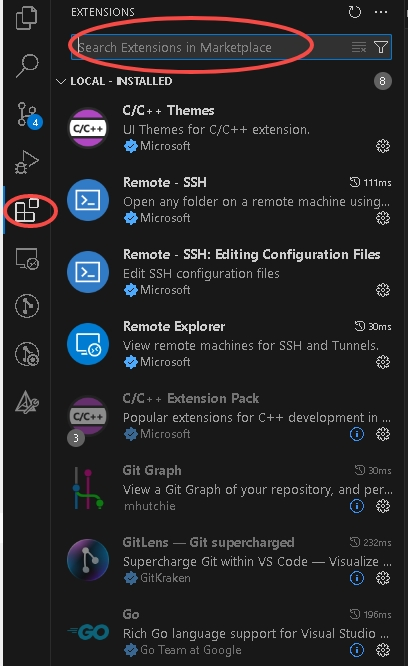

#### Visual Studio Code 中 SSH 必要的配置项

从配置进入 SSH 配置项（如图一），仿照下面第二张图把自己的 SSH 客户端配置到 Visual Studio Code 中。对于其他 SSH 配置项，如无相关知识请勿修改，错误配置可能导致异常问题。


#### 配置 Visual Studio Code 中的 SSH 连接

1. 在 Visual Studio Code 中添加 SSH 的连接信息

    插件装好，SSH 命令配置好以后，如下图点击左下角按钮，在弹出命令中选择 `connect current window to host`

    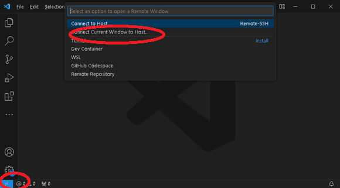

2. 在弹出窗口中，选择 `Configure SSH Hosts`

    

3. 选择配置文件

    Visual Studio Code 往往会提示 2 个配置文件，一个是形如当前的，另一个是在 `%USERPROFILE%/.ssh` 目录下的。推荐使用 `%USERPROFILE%/.ssh` 目录下的文件。如果文件不存在，第一次配置时需要手动创建一个文件。否则可能选定文件后没有反应。

    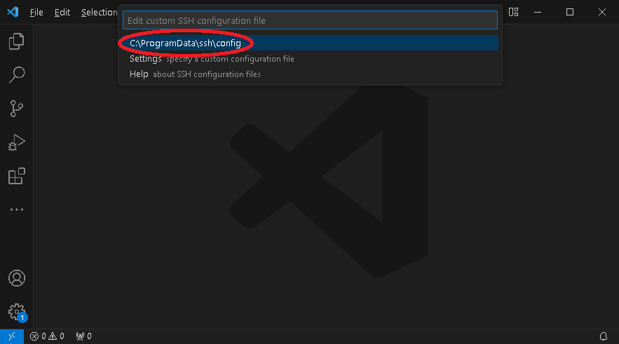

4. 加入你要配置的远程连接信息

    内容形式如下图：

    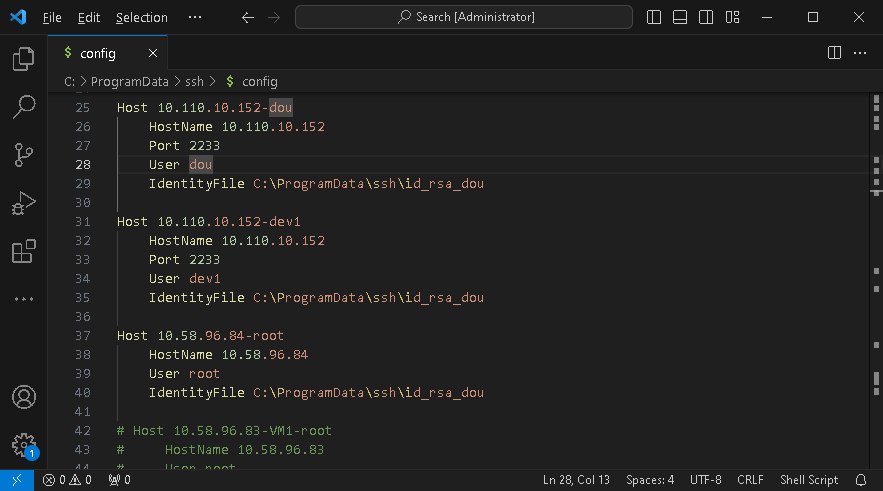

    对于[SSH 配置](#ssh-配置)中的验证命令

    ```bash
    D:\soft_install\tools\PortableGit\usr\bin\ssh.exe -i C:\Users\douzhitong\.ssh\id_rsa -p 2233 -l dev2 10.110.10.168
    ```

    根据上述 SSH 命令，相应的配置内容格式如下（其中 Host 字段可自定义名称，其他字段需严格按照实际参数填写）：

    ```bash
    Host 10.110.10.168(dev2)
        HostName 10.110.10.168
        Port 2233
        User dev2
        IdentityFile C:\Users\douzhitong\.ssh\id_rsa
    ```

    完成配置后，请保存文件。

#### 验证和初始化 SSH 连接

重新发起连接，选中刚刚建立的连接，类似于下图：


如下图：所有 Visual Studio Code 到服务器的连接建立时，右下角都会出现提示。

第一次连接的时候 Visual Studio Code 会提示服务器类型，我们是 Linux，所以选择 Linux


选择 Linux Visual Studio Code 会在 Linux 系统中，你的账户下下载服务端软件，期间提示信息如下图。

:::warning
由于网络下载速度的影响，此过程可能耗时较长（约30分钟），请耐心等待。有的时候下载会中断，提示界面会一直卡在这里。这种情况下关闭 Visual Studio Code 窗口，再次启动后重新尝试连接，这个下载行为会断点续传。
:::


如果担心你的 Linux 账户下配置异常或者下载异常，到你自己的用户目录下做下面操作验证文件在下载中：

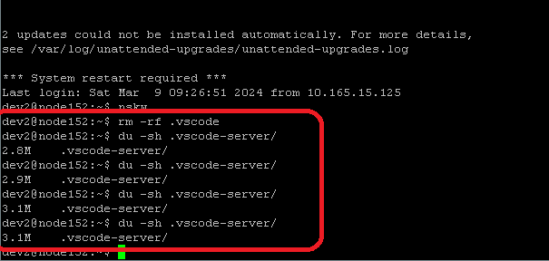

如果怀疑网络连通性有问题，在 Linux 系统中 `ps -ef |grep wget` 尝试拿到原始命令行，然后手动试验是否存在到 Visual Studio Code 的 Web 服务器的连通性问题。

:::warning
VSCode Server 与开发使用的 Visual Studio Code 客户端版本相互锁定。如果你在 A 机器使用 Visual Studio Code V1.70，而在 B 机器使用 V1.80，这 2 个机器第一次连接相同的 Linux 开发 ID 时，都需要很长时间下载 Visual Studio Code Server（不同版本）。
:::

完成此步骤后，系统将进入就绪状态，并提示可打开目录。

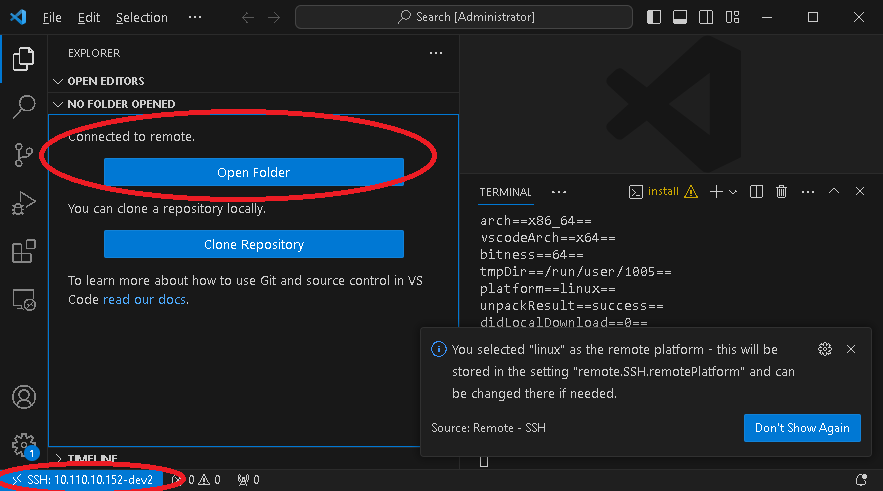

#### Visual Studio Code 插件和在 Linux 连接中的安装

1. 把 Visual Studio Code 本地插件安装到 Linux 服务器端

    如下图，依次点击所有椭圆标记的选项。此安装过程耗时较长。安装完毕后，服务器端的插件功能也装到了 `$HOME/.vscode-server` 目录下。 插件安装不上会影响代码流量体验和调试，但是不影响其它编辑开发工作。

    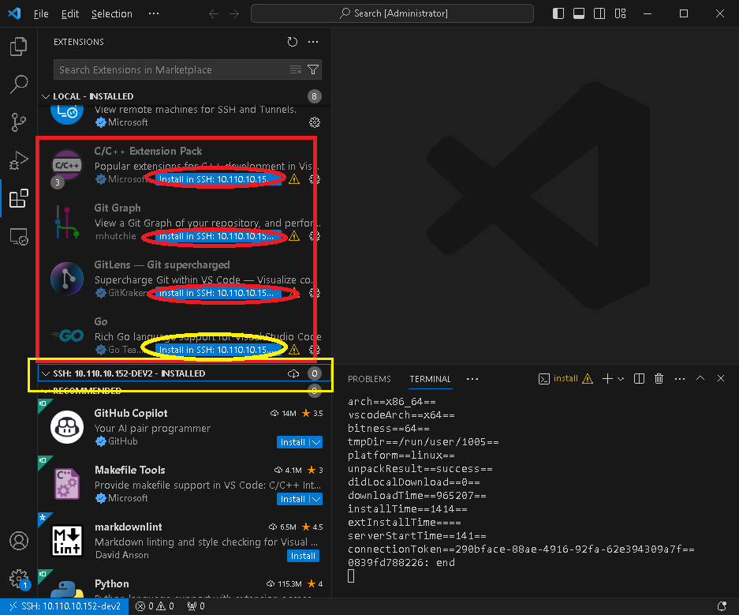

    安装过程中，插件会显示 `installing` 提示，顶部有动态进度条。此过程耗时较长（可能需要10-20分钟），可能出现下载停滞问题，建议断开连接后重新尝试。若遇到网络连接问题，需等待网络恢复后再进行操作。

    

    安装完成的插件，会在中间这个窗口有提示：

    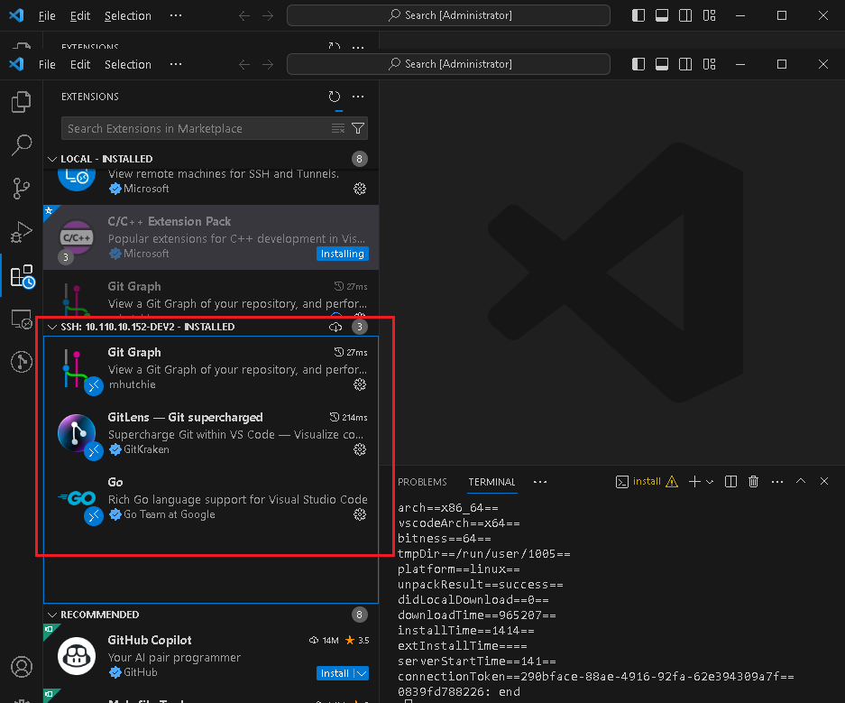

    这一步做完后重启 Visual Studio Code。

    :::warning
    各个插件的版本与 Go 版本密切相关，默认安装与当前匹配的插件版本。如果安装插件后 Go 版本发生切换，可能遇到由于版本不匹配的各种问题。
    :::

2. Visual Studio Code 中安装 Go 安装的必要工具

    在 Visual Studio Code 的 terminal 中暂时打开 `GO111MODULE`

    

    国内用户需要运行下面命令，配置 Go 的 proxy：

    ```bash
    go env -w GOPROXY=https://goproxy.cn,direct
    ```

    首先确保你的开发环境中 Go 的版本是 1.16 以上（`go version` 命令验证）。满足版本要求时，在 Visual Studio Code 中按 `Shift + Ctrl + P`，进入命令行状态，如图选择安装 Go 工具（需要提前配置好 GOPROXY）。 请注意，此操作依赖于 Visual Studio Code 能够检测到的服务器端 Go 版本，不同版本的 Go 可能导致安装的 Go 插件版本存在差异。

    

    选择全部组件

    

    安装完成后有相应提示：

    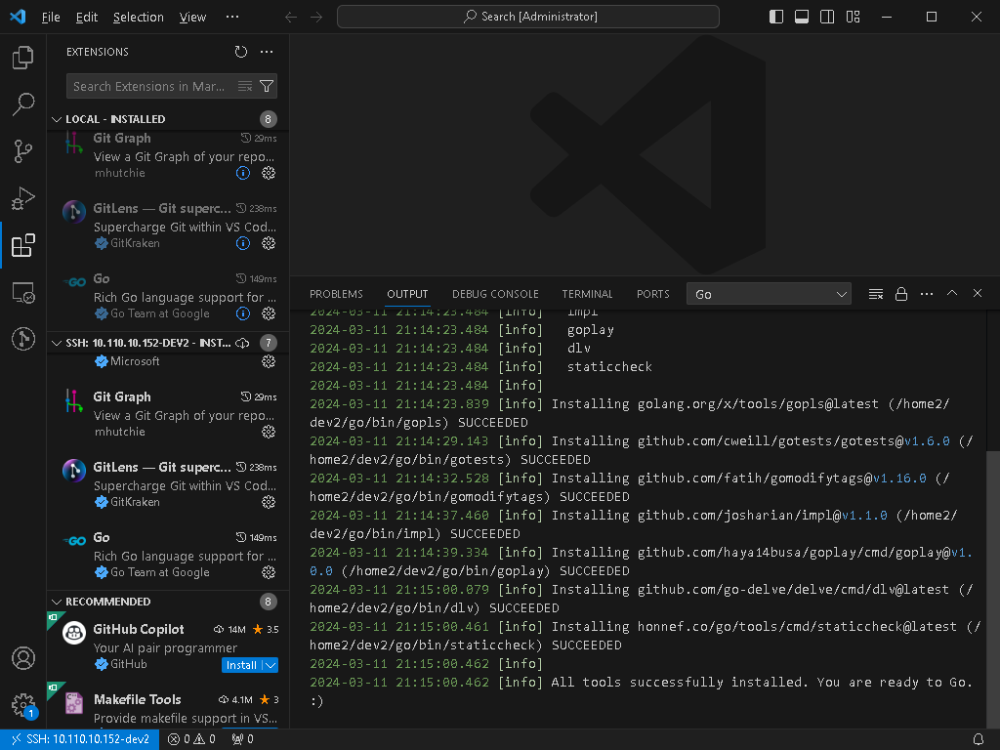

    安装完毕之后，在 Visual Studio Code 的 terminal 中关闭 `GO111MODULE`：

    ```bash
    go env -w GO111MODULE=off
    ```

#### 打开代码项目

提前 clone 好代码，按提示打开如下图。注意 Visual Studio Code 也会驱动 Go 在后台扫描代码，所以使用 Visual Studio Code 打开前最好能在代码目录下做一次编译，这样 Visual Studio Code 提示的错误或警告会少一些。


#### 代码调试

Visual Studio Code 中可以有多个调试 profile（调试配置），按 `F5`（图中红色圆圈1）启动的是默认的模式（图中红色圆圈2）。
点击配置按钮（图中红色圆圈3）可以打开配置文件（第一次打开时需要创建）。 配置文件名为 `launch.json`，里面的内容是可以自行配置的，可以参考[附录样例](#launchjson-样例)，里面有多种情况下使用的调试配置。


### Visual Studio Code 服务器端配置迁移

#### vscode-server

本文上述的配置步骤假设的是使用 Windows 上的 Visual Studio Code 客户端，远程访问 Linux 上（或任意通过 SSH 访问的 Linux 虚机或容器）的某个账号。 上文也提到过，不同的 Visual Studio Code 版本访问同一 Linux 账号时，会在 Linux 侧下载与之匹配的 vscode-server 的版本，以及插件的版本。

对于这个 Linux 的账号来说，所有访问通过 Visual Studio Code 访问过它，所有 vscode-server 版本二进制和插件二进制，都保存在 `$HOME/.vscode-server` 目录下。 如果有其它相同架构、相同 OS 的 Linux 开发环境（最好用户名也想同），可将 `.vscode-server` 目录打包并复制到新环境中。这样原有 VSCode 客户端可以直接访问新的环境，不需要重装 vscode-server 和插件。

#### Golang 插件的工具

Visual Studio Code 中 Go 插件安装的工具默认安装到 `$GOPATH/bin` 目录下，默认安装后都是二进制文件。可直接复制到新开发环境的对应目录中，与前一小节复制的 vscode-server 配合使用即可正常运行。

#### 调试配置和其他项目相关配置

Visual Studio Code 项目/目录中的配置，包括调试配置，保存在 `${workspaceRoot}/.vscode` 目录中，文件名为 `settings.json`  和 `launch.json`。若工作代码库相同，这两个文件可直接复制使用。

## 已知问题

1. 调试过程中可能出现 dlv 异常退出的情况，通常重试操作即可恢复正常；若问题持续，请[重新安装 Linux 连接中的 Go 工具](#visual-studio-code-插件和在-linux-连接中的安装)。
2. 各种插件也会自动更新，插件更新中可能会出现一些异常。
3. Go 代码的查看和跳转依赖在 Linux 开发环境中的 gopls 进程（作为 Go Tools 安装的一部分），该进程通常会占用 3-5GB 内存。若系统资源不足，可选择不安装该组件，或在配置项中关闭 language server，但会影响 `F12` 查看定义等功能。
4. Visual Studio Code 中的 Go 插件要求 Go 运行时版本不低于 1.16（或者更高），但是我们开发环境中执行 `make test` 等测试的标准环境是 1.15.14   建议开发过程中使用较高版本的 Go 以便开发调试，在 push 代码前切换至 1.15 版本进行测试验证。

## 常用操作

### Visual Studio Code 的操作与 GoLand 不同

`Ctrl + P` - 根据文件名在项目中搜索文件
`Ctrl + Shift + F` - 全文搜索函数名等关键字（在左侧的搜索框中）
`Ctrl + T` - 使用 Go 插件搜索 Go 代码的符号，例如函数名称
`F12` - 跳转到当前函数或变量的定义处（Go 或 C++ 插件支持，若功能异常，请检查插件状态）
`Shift + F12` - 查看当前选中符号的引用（可能响应较慢）

### 使用 Visual Studio Code 代理 kwbase的服务（--listen-addr或--http-addr端口到本地）

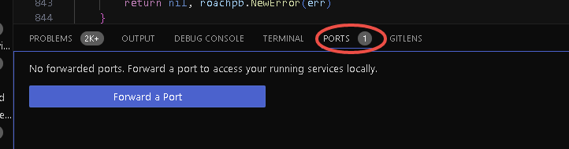

只需在弹出窗口中输入服务器端正在监听的端口

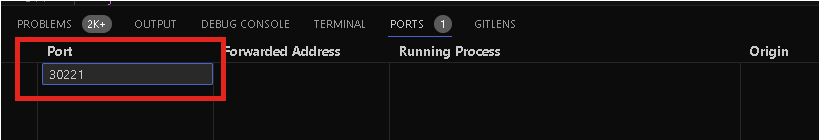

Visual Studio Code 插件将自动填充后续字段

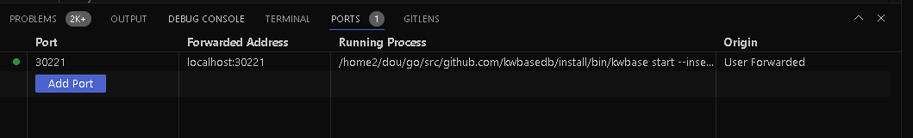

随后就可以访问指定端口了。

## 附录

### launch.json 样例

[下载 launch.json](./assets/launch.json)

```json title="launch.json"
{
    // Use IntelliSense to learn about possible attributes.
    // Hover to view descriptions of existing attributes.
    // For more information, visit: https://go.microsoft.com/fwlink/?linkid=830387
    "version": "0.2.0",
    "configurations": [
        {
            "name": "(gdb) Attach AE V1.2",
            "type": "cppdbg",
            "request": "attach",
            "program": "${workspaceRoot}/install/bin/kwdbts_server",
            "MIMode": "gdb",
            "setupCommands": [
                {
                    "description": "Enable pretty-printing for gdb",
                    "text": "-enable-pretty-printing",
                    "ignoreFailures": true
                },
                {
                    "description": "Set Disassembly Flavor to Intel",
                    "text": "-gdb-set disassembly-flavor intel",
                    "ignoreFailures": true
                }
            ]
        },
        {
            "name": "(gdb) Attach kwbase",
            "type": "cppdbg",
            "request": "attach",
            "program": "${workspaceRoot}/install/bin/kwbase",
            "MIMode": "gdb",
            "setupCommands": [
                {
                    "description": "Enable pretty-printing for gdb",
                    "text": "-enable-pretty-printing",
                    "ignoreFailures": true
                },
                {
                    "description": "Set Disassembly Flavor to Intel",
                    "text": "-gdb-set disassembly-flavor intel",
                    "ignoreFailures": true
                }
            ]
        },
        {
            "name": "(Go) Launch kwbase V2.0",
            "type": "go",
            "request": "launch",
            "cwd": "${workspaceRoot}/install/bin",
            "mode": "exec",
            "env": {"KWDB_ROOT":"${workspaceRoot}/install",
            "LD_LIBRARY_PATH":"/usr/local/lib:${workspaceRoot}/install/lib"},
            "program": "${workspaceRoot}/install/bin/kwbase",
            "args": ["start",
                    "--insecure",
                    "--listen-addr=0.0.0.0:20257",
                    "--http-addr=0.0.0.0:20080",
                    "--store=/home2/dev2/kwbase_data/n31",
                    "--join=0.0.0.0:20257"
                    ],
            "dlvFlags": [
                        "--check-go-version=false"
                    ]
        },
        {
            "name": "(gdb) Launch kwbase V2.0",
            "type": "cppdbg",
            "request": "launch",
            "program": "${workspaceRoot}/install/bin/kwbase",
            "args": ["start",
                    "--insecure",
                    "--listen-addr=0.0.0.0:20257",
                    "--http-addr=0.0.0.0:20080",
                    "--store=/home2/dev2/kwbase_data/n31",
                    "--join=0.0.0.0:20257"
                    ],
            "stopAtEntry": false,
            "cwd": "${workspaceRoot}/install/bin",
            "environment": [{"name":"KWDB_ROOT", "value":"${workspaceRoot}/install"},
                            {"name":"LD_LIBRARY_PATH", "value":"${workspaceRoot}/install/lib"}],
            "externalConsole": false,
            "MIMode": "gdb",
            "setupCommands": [
                //{"text": "set detach-on-fork off"},
                //{"text": "set follow-fork-mode child"},
                {
                    "description": "Enable pretty-printing for gdb",
                    "text": "-enable-pretty-printing",
                    "ignoreFailures": true
                },
                {
                    "description": "Set Disassembly Flavor to Intel",
                    "text": "-gdb-set disassembly-flavor intel",
                    "ignoreFailures": true
                }
            ]
        },
        {
            "name": "(Go) Attach to Process",
            "type": "go",
            "request": "attach",
            "mode": "local",
            "processId": 0
        }
]
}
```

### 虚机或容器环境 Visual Studio Code 中 SSH 连接的配置


